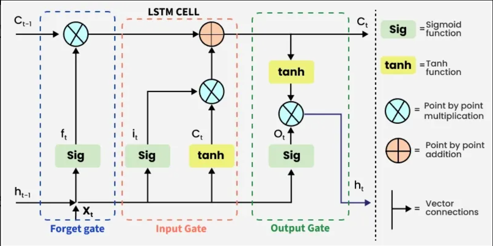

## Long short-term memory

Long short-term memory (LSTM) is a type of **recurrent neural network (RNN)** aimed at mitigating the vanishing gradient problem, commonly encountered by traditional RNNs. 
Its relative insensitivity to gap length is its advantage over other RNNs, hidden Markov models, and other sequence learning methods. 
It aims to provide a short-term memory for RNN that can last thousands of timesteps (thus "long short-term memory").

---

## Problem with Long-Term Dependencies in RNN
Recurrent Neural Networks (RNNs) are designed to handle sequential data by maintaining a hidden state that captures information from previous time steps. However they often face challenges in learning long-term dependencies where information from distant time steps becomes crucial for making accurate predictions for current state. This problem is known as the vanishing gradient or exploding gradient problem.

 - Vanishing Gradient: When training a model over time, the gradients which help the model learn can shrink as they pass through many steps. This makes it hard for the model to learn long-term patterns since earlier information becomes almost irrelevant.
 - Exploding Gradient: Sometimes gradients can grow too large causing instability. This makes it difficult for the model to learn properly as the updates to the model become erratic and unpredictable.

Both of these issues make it challenging for standard RNNs to effectively capture long-term dependencies in sequential data.

---

## Architecture of LSTM Cell

LSTM architectures involves the memory cell which is controlled by three gates:

 - Input gate: Controls what information is added to the memory cell.
 - Forget gate: Determines what information is removed from the memory cell.
 - Output gate: Controls what information is output from the memory cell.
   
This allows LSTM networks to selectively retain or discard information as it flows through the network which allows them to learn long-term dependencies. The network has a hidden state which is like its short-term memory. This memory is updated using the current input, the previous hidden state and the current state of the memory cell.

> Image taken from [here](https://www.geeksforgeeks.org/deep-learning/deep-learning-introduction-to-long-short-term-memory/)
